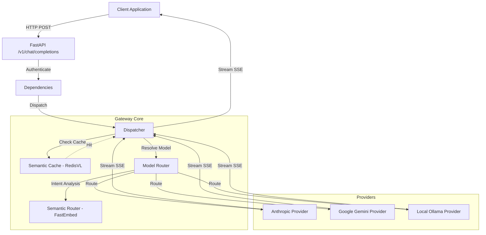

# LLM Gateway

A FastAPI-based gateway that routes requests to multiple LLM providers through a unified interface. The system supports semantic routing, semantic caching, and uses the OpenAPI schema.

## Architecture

The gateway acts as an orchestrator between client applications and LLM providers.



### Components

- **Dispatcher (`app/gateway/dispatcher.py`)**: Manages the request lifecycle, orchestrates the cache and router, and handles Server-Sent Events (SSE).
- **Model Router (`app/gateway/router.py`)**: Maps model identifiers to provider implementations using static aliases or intent-based resolution.
- **Semantic Router (`app/gateway/semantic_router.py`)**: Uses `FastEmbed` to categorize user prompts and select providers or models based on predefined intent categories.
- **Semantic Cache (`app/gateway/cache.py`)**: Uses `RedisVL` to store and retrieve responses based on the semantic similarity of prompts.
- **Providers (`app/providers/`)**: Adapters for Anthropic, Google Gemini, and Ollama SDKs that provide a uniform interface for streaming and error handling.

## Features

- **OpenAI-Compatible API**: Implements a completion endpoint compatible with common LLM clients.
- **Semantic Routing**: The `auto` model identifier triggers an intent-based selection of the provider and model.
- **Semantic Caching**: Responses are cached and retrieved using vector similarity via Redis.
- **Streaming**: Supports real-time response delivery through SSE.
- **Standardized Error Handling**: Provider-specific exceptions are mapped to a consistent set of gateway error types.

## Installation and Setup

### Prerequisites

- Python 3.14+
- [uv](https://github.com/astral-sh/uv)
- Redis server

### Setup

1. **Clone the repository:**
   ```bash
   git clone <repository-url>
   cd llm-gateway
   ```

2. **Install dependencies:**
   ```bash
   uv sync
   ```

3. **Environment Configuration:**
   Create a `.env` file with the following variables:
   ```bash
   GATEWAY_API_KEY=your-secure-gateway-key
   
   # Provider API Keys
   ANTHROPIC_API_KEY=sk-ant-...
   GEMINI_API_KEY=AIza...
   OLLAMA_BASE_URL=http://localhost:11434
   
   # Redis Configuration
   REDIS_URL=redis://localhost:6379
   SEMANTIC_CACHE_THRESHOLD=0.1
   ```

4. **Run the server:**
   ```bash
   uv run python main.py
   ```

## Configuration

### Model Routing and Aliases

The system maps model names to providers. Default aliases include:

- `auto`: Triggers intent-based semantic routing.
- `fast`: Mapped to `gemini-2.0-flash`.
- `smart`: Mapped to `claude-opus-4-6`.
- `local`: Mapped to `qwen3.5` (Ollama).

### Advanced Settings

| Variable | Default | Description |
|---|---|---|
| `SEMANTIC_ROUTER_ENABLED` | `True` | Enables intent-based routing. |
| `EMBEDDING_MODEL` | `BAAI/bge-small-en-v1.5` | Embedding model for routing and caching. |
| `SEMANTIC_CACHE_THRESHOLD` | `0.1` | Vector distance threshold for cache hits. |
| `[PROVIDER]_TIMEOUT` | Varies | Timeout in seconds per provider. |

## API Reference

### `POST /v1/chat/completions`

**Authentication:** `x-api-key` header required.

**Request Body:**
```json
{
  "model": "auto",
  "messages": [
    {"role": "user", "content": "Query text here."}
  ],
  "temperature": 0.7,
  "stream": true
}
```

**Response:** `text/event-stream` delivering JSON chunks.

### `GET /health`
Returns the operational status of the gateway.

### `GET /health/providers`
Returns the connectivity status for each configured provider.

## Error Handling

The gateway maps provider-specific errors to the following HTTP status codes:

| Error Type | Status Code | Description |
|---|---|---|
| `AuthenticationError` | `401` | Invalid API key. |
| `InvalidRequestError` | `400` | Malformed request parameters. |
| `RateLimitError` | `429` | Provider rate limit reached. |
| `ProviderTimeoutError` | `504` | Provider response timeout. |
| `ProviderUnavailableError` | `502` | Provider is unreachable. |
| `UnknownModelError` | `404` | Model or alias not found. |
| `ConfigurationError` | `500` | Gateway configuration error. |

Streaming errors are returned as SSE events:
```
event: error
data: {"error": "...", "code": 502, "provider": "anthropic"}
```

## Testing

Execute the test suite using `pytest`:

```bash
uv run pytest
```
